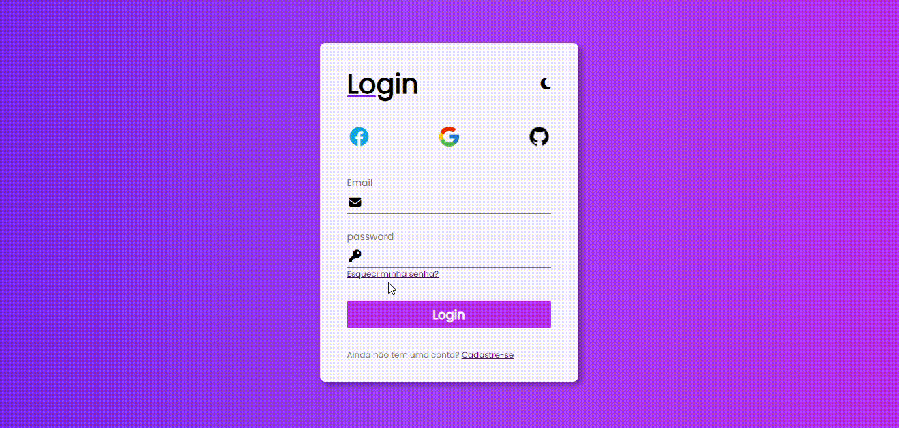

## Projeto Login

Esse projeto consiste em uma tela de login com cadastre-se e esqueci a senha

**índice**

* [Tecnologias_utilizadas](#tecnologias-utilizadas)
* [Informações adicionais](#informações)
* [Recursos](#Recursos)
* [Autores](#autores)

## Tecnologias utilizadas:

* [<code></code>](https://developer.mozilla.org/pt-BR/docs/Web/HTML)
* [<code></code>](https://developer.mozilla.org/pt-BR/docs/Web/CSS)
* [<code></code>](https://github.com/)
* [<code></code>](https://git-scm.com/)
* [<code></code>](https://code.visualstudio.com/)
* [<code></code>](https://fontawesome.com/versions)
* [<code></code>](https://fontawesome.com/versions)
* [<code></code>](https://fonts.google.com/)

## Informações adicionais:

* O projeto consiste em três telas de login:
    * Tela inicial (index.html)
    * Tela de recuperação de senha (index2.html)
    * Tela de cadastro (index3.html)
    * Tela de boas-vindas (bem-vindo.html)
* Cada tela possui um formulário com os campos necessários para a sua função.
* A tela inicial possui ícones de redes sociais, link para a tela de recuperação de senha, link para a tela de cadastro e ícone de modo claro/escuro.
* As telas possuem validação de preenchimento dos campos.
* As telas possuem animação de troca de modo claro/escuro.
* O código está organizado e documentado.
* O projeto é responsivo e funciona em diferentes dispositivos.

## Recursos:

* Font Awesome: [https://fontawesome.com/](https://fontawesome.com/)
* Google Fonts: [https://fonts.google.com/](https://fonts.google.com/)
* Documentação HTML5: [https://developer.mozilla.org/pt-BR/docs/Web/HTML](https://developer.mozilla.org/pt-BR/docs/Web/HTML)
* Documentação CSS3: [https://developer.mozilla.org/pt-BR/docs/Web/CSS](https://developer.mozilla.org/pt-BR/docs/Web/CSS)
* Documentação JavaScript: [https://developer.mozilla.org/pt-BR/docs/Web/JavaScript](https://developer.mozilla.org/pt-BR/docs/Web/JavaScript)

**Linkedin**

[publicação do projeto no linkedin](https://www.linkedin.com/posts/fellipe-zanin-1b1a7728b_desenvolvedorweb-frontend-htmlcssjavascript-activity-7189266133743529986-3QwA?utm_source=share&utm_medium=member_desktop)

## Autores
| [ Fellipe Gabriel Zanin](https://github.com/Fell1pe) |

